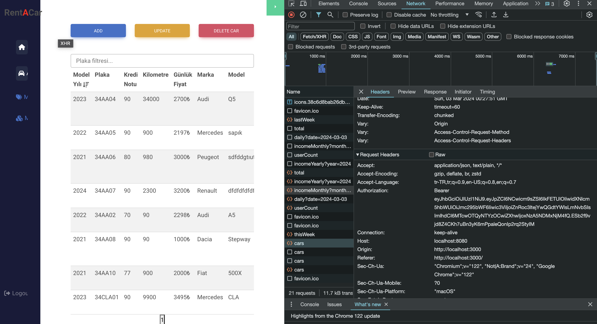

# Giriş ve Kayıt İşlemleri
---
Giriş ve kayıt işlemleri, bir uygulamanın en temel işlevlerinden biridir. Kullanıcıların sistemdeki kimliklerini doğrulamak ve yetkilendirmek için kullanılır.

## JWT (JSON Web Token)
---
JWT, kullanıcıların kimliklerini doğrulamak için kullanılan bir yöntemdir. Bir kullanıcı giriş yaptığında, sunucu bir JWT oluşturur ve bunu kullanıcıya gönderir. Kullanıcı, bu jetonu her istekte sunucuya geri gönderir, böylece sunucu kullanıcının kim olduğunu doğrulayabilir.

## Interseptörler
---
Interseptörler, bir uygulamanın ağ isteklerini yönetme şeklidir. Bir interseptör, bir isteğin gönderilmesinden önce veya bir yanıtın alınmasından sonra çalışabilir. Örneğin, bir interseptör, her isteğe JWT ekleyebilir, böylece sunucu isteği doğrulayabilir.

Bu iki teknoloji, bir uygulamanın güvenli ve etkili bir şekilde kullanıcıları yönetmesine yardımcı olur.

## HTTP Interseptörleri
---
HTTP Interseptörleri, bir uygulamanın ağ isteklerini ve yanıtlarını yönetme şeklidir. İstekler gönderilmeden önce veya yanıtlar alındıktan sonra çalışabilirler.

### İstek Interseptörü
---
Bir istek interseptörü, bir istek gönderilmeden önce çalışır. Örneğin, bir JWT eklemek için kullanılabilir.

```javascript
axios.interceptors.request.use(request => {
  request.headers['Authorization'] = 'Bearer ' + token;
  return request;
});
```

> <br><br>


<-- [Kurulum](kurulum.md)                  [Demo](demo.md) --> 