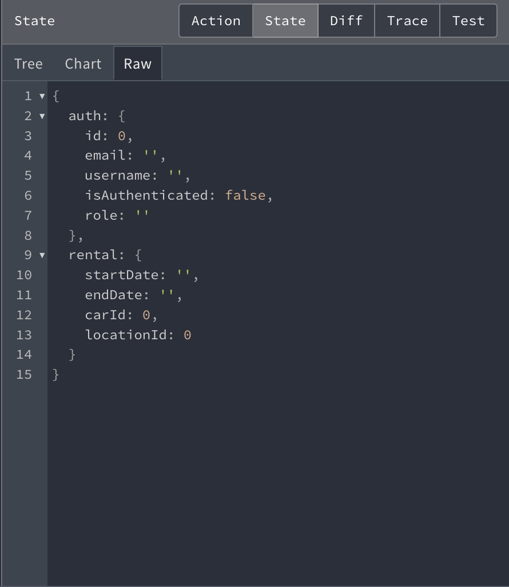

## Redux

[Redux](https://redux.js.org/) JavaScript uygulamaları için öngörülebilir durum konteyneridir. Özellikle React veya Angular gibi JavaScript kütüphaneleriyle büyük uygulamalar geliştirirken uygulamanın durumunu yönetmek için kullanılır.

Redux, uygulamanın durumunu tek bir yerde saklar. Bu, durumun nasıl değiştiğini kontrol etmeyi ve hata ayıklamayı kolaylaştırır.

Redux'un üç temel prensibi vardır:

1. **Tek kaynak doğruluk:** Tüm uygulama durumu tek bir "durum ağacı" içinde saklanır.
2. **Durum okunabilir:** Durum sadece eylemler tarafından değiştirilebilir.
3. **Değişiklikler saf işlevlerle yapılır:** Eylemler, durum ağacını nasıl dönüştüreceğini belirten saf işlevlerdir.

Redux, durum yönetimini merkezi ve öngörülebilir hale getirerek karmaşık JavaScript uygulamalarının geliştirilmesini kolaylaştırır.

```ts
// userSlice.js
import { createSlice, PayloadAction } from '@reduxjs/toolkit';
import { loadAuthState } from './storage';
import { setToken } from '../../utils/Interceptors';


export const authSlice = createSlice({
  name: 'auth',
  initialState: loadAuthState(),

  reducers: {
    loginSuccess: (state, action) => {
      state.id = action.payload.id;
      state.email = action.payload.sub;
      state.username = action.payload.username;
      state.role = action.payload.role;
      state.isAuthenticated = true;
    },
    logoutSuccess: (state) => {
      state.id = 0;
      state.role = "";
      state.email = "";
      state.username = "";
      setToken()
      state.isAuthenticated = false;
    },
  },
})
export const { loginSuccess, logoutSuccess } = authSlice.actions;

```


burada redux'ı kullanarak user bilgilerini aldık ve bu bilgileri istediğimiz zaman dispatch edebiliriz ve useSelector ile redux a attığımız bilgileri çekebiliriz kısaca dispatch etmek ne useSelector kullanarak veri almak ne demek ondan bahsedeyim 

Redux, uygulamanın durumunu yönetmek için `dispatch` ve `useSelector` gibi bazı temel fonksiyonlar sağlar.

### Dispatch

`dispatch` fonksiyonu, Redux durumunu güncellemek için kullanılır. Bir eylem oluşturucu tarafından döndürülen bir eylemi alır ve bu eylemi Redux'a gönderir. Redux, bu eylemi alır ve ilgili indirgeyiciyi çağırır, durumunu günceller.

Örneğin, bir kullanıcının bilgilerini güncellemek için bir eylem oluşturucu ve `dispatch` kullanabilirsiniz:

```javascript
const updateUser = (newUser) => {
  return {
    type: 'UPDATE_USER',
    payload: newUser
  }
}

dispatch(updateUser({ name: 'John Doe' }));
```
useSelector fonksiyonu, Redux durumundan veri almak için kullanılır. Bir seçici işlev alır ve bu işlevi Redux durumuna uygular.
```ts
const user = useSelector(state => state.user);
```
----
1. [Redux ile alakalı daha fazla bilgi almak için medium yazımı okuyunuz...](https://medium.com/@fthsymz60/modern-react-uygulamalar%C4%B1nda-durum-y%C3%B6netimi-redux-kullan%C4%B1m%C4%B1-8fc6fde468f7)