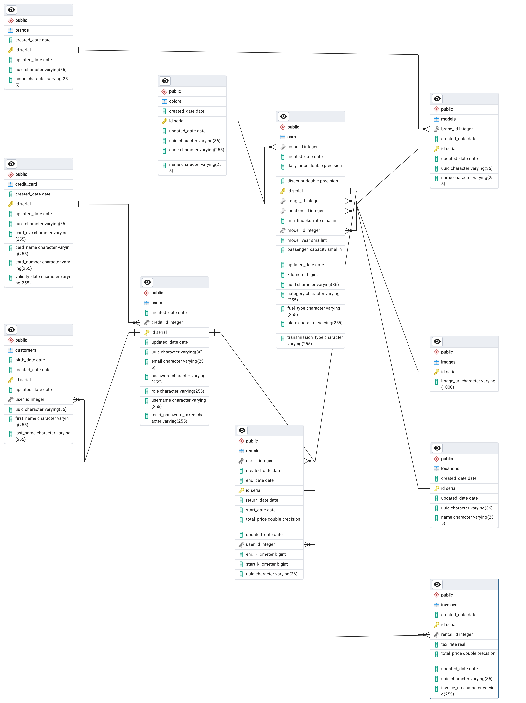

<h1 align="center">
   
  
   
  RENTACAR PROJESİ 
   
</h1>

# RentACar Backend

Bu proje, RentACar web uygulamasının backend kısmını oluşturmak için Spring Boot kullanılarak geliştirilmiştir.

## Gereksinimler

- Java 17
- Maven
- SpringBoot Framework
- Swagger UI

  <table style="border: none">
    <tr>
      <td style="border: none;" align="center"><a href="https://www.oracle.com/tr/java/technologies/downloads/"> 
Java 17
</a></td>
      <td style="border: none;" align="center"><a href="https://spring.io/"> 
SpringBoot
</a></td>
      <td style="border: none;" align="center"><a href="https://mvnrepository.com/"> 
Maven
</a>
    <td style="border: none;" align="center"><a href="https://swagger.io/"> 
Swagger UI
</a></td>
    </tr>

    
  </table>

## Kullanılan Teknolojiler ve Kütüphaneler

- Spring Boot: Backend uygulamasını geliştirmek için kullanılan framework.
- Spring Data JPA: Veritabanı işlemlerini kolaylaştırmak için kullanılan Spring modülü.
- Spring Web: HTTP isteklerini işlemek ve RESTful API'ler oluşturmak için kullanılan Spring modülü.
- Spring Security: Uygulama güvenliği için kullanılan Spring modülü.
- PostgreSQL: Veritabanı olarak kullanılan ilişkisel veritabanı yönetim sistemi.
- Lombok: Java kodunu daha sade ve okunabilir hale getirmek için kullanılan bir kütüphane.
- Springdoc OpenAPI: OpenAPI belgeleri oluşturmak ve Swagger UI sağlamak için kullanılan Spring modülü.
- ModelMapper: Nesne eşleme işlemleri için kullanılan bir kütüphane.
- JWT (JSON Web Token): Kullanıcı kimlik doğrulaması için kullanılan bir standart.
- Cloudinary: Medya depolama ve işleme hizmeti sağlayan bulut tabanlı bir platform.

## Kullanılan Veritabanı

Bu proje, PostgreSQL veritabanını kullanmaktadır. Veritabanı bağlantı bilgileri `application.properties` dosyasında yapılandırılmıştır. Proje çalıştırılmadan önce uygun bir PostgreSQL veritabanı oluşturulmalı ve bağlantı bilgileri güncellenmelidir.

## ERD Daigramı
 <td style="border: none;" align="center"> 

</a></td>

## RentACar BackUp
<td style="border: none;" align="center"><a href=".rentacarbackup/rentacarbackup.sql"> 
RentACar Backup
</a></td>

## BackUp Kurulum

1. Dosyaların içinde bulunan `.rentacarbacup` dosyasına bulunan dosyayı indirin.
2. PostgreSQL veritabanınızda oluşturmuş olduğunuz boş veri tabanına sağ tıklayın ve `.Restore` seçeneğine seçin.
3. İkinci satırda bulunan: `FileName` inputunun içindeki dosya ikonuna tıklayarak indirmiş olduğunuz backup dosyasını seçin.
4. Sağ alt köşede bulunan: `Restore` butonuna basın. Veri tabanınızı  `Refresh` edip kullanabilirsiniz.
5. Veri tabanınızı  `Refresh`edip kullanabilirsiniz.

## Önemli Not
1. Yüklemiş olduğunuz Backupta `user` tablosunda kullanıcı rolleri  defaut olarak `User` gelmektedir. Admin paneline ulaşabilmek için oluşturmuş olduğunuz kullanıcının rolünü veri tabanından `ADMIN` olarak güncelleyiniz.

## Kurulum

1. Projeyi bilgisayarınıza klonlayın: `git clone https://github.com/kullaniciadi/proje.git`
2. PostgreSQL veritabanınızı oluşturun ve `application.properties` dosyasında gerekli veritabanı bağlantı bilgilerini güncelleyin.
3. Projeyi Maven ile derleyin: `mvn clean install`
4. Uygulamayı başlatın: `java -jar target/pair8-0.0.1-SNAPSHOT.jar`

## Kullanım

- Uygulama başlatıldıktan sonra `http://localhost:8080/swagger-ui.html` adresine giderek API belgelerini ve endpoint'leri görebilirsiniz.
- Örnek kullanım senaryoları için API belgelerini inceleyebilirsiniz.

## Katkılar

- Projeye katkı sağlamak isterseniz, lütfen bir fork oluşturun ve pull request gönderin.
- Herhangi bir hata veya sorunla karşılaşırsanız, lütfen bir [issue](https://github.com/kullaniciadi/proje/issues) açın.

